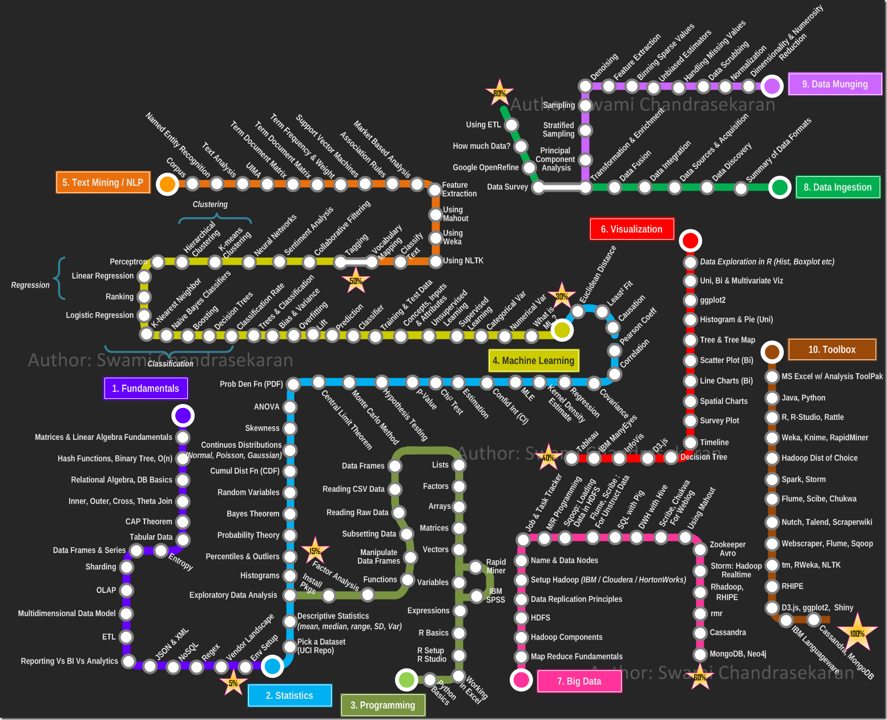

# ML Class

This repo is to share information about ML resources, notebooks, etc. 
Most of the information will be from [An Introduction to Statistical Learning](http://www-bcf.usc.edu/~gareth/ISL/) textbook, which utilizes R for its labs and assignments. However, if you prefer Python, [this github repo](https://github.com/JWarmenhoven/ISLR-python) has all of the code written in Python. 

Once we have covered the basics through the ISL book, the followup textbook is [The Elements of Statistical Learning](https://web.stanford.edu/~hastie/ElemStatLearn//)

## Required Downloads

* [Python 3](https://python.org/)
	* [Anaconda Distribution](https://www.anaconda.com/download/#macos) (includes most libraries we need)
* [R (Language)](https://www.r-project.org/)
* [R Studio](https://www.rstudio.com/products/rstudio/download/)
* [Jupyter Notebooks](https://jupyter.org/) (included in Anaconda)
* [Git](https://git-scm.com/)
* [SQL Developer](https://www.oracle.com/technetwork/developer-tools/sql-developer/downloads/index.html)
* [SQL Data Modeler](https://www.oracle.com/technetwork/developer-tools/datamodeler/downloads/datamodeler-087275.html)

## Helpful Sites for Practice/Learning

* [Kaggle](https://www.kaggle.com/)
* [DataCamp](https://www.datacamp.com/home)
* [DataQuest](https://www.dataquest.io/dashboard)
	* [Advanced Jupyter Notebooks Tutorial](https://www.dataquest.io/blog/advanced-jupyter-notebooks-tutorial/)
	* [18 Places to Find Data Sets for Data Science Projects](https://www.dataquest.io/blog/free-datasets-for-projects/)
* [Khan Academy](https://www.khanacademy.org/) (for Statistics/Probability/Linear Algebra)
* [r/DataScience](https://www.reddit.com/r/datascience)
* Helpful Udemy Courses:
	* [Python for Data Science and Machine Learning Bootcamp](https://www.udemy.com/python-for-data-science-and-machine-learning-bootcamp/)
	* Anything by [Jose Portilla](https://www.udemy.com/user/joseportilla/) is worth your time

## Helpful Sites for Finding Data

* [Kaggle](https://www.kaggle.com/)
* [r/DataSets](https://www.reddit.com/r/datasets)
* [Data.gov](https://www.data.gov/)

## Scope 

In order to fully comprehend what is going on with these Machine Learning Models, there are a few topics we are going to have to skim before we start jumping into how the algorithms work. According to map below, from [Swami Chandrasekaran](http://nirvacana.com/thoughts/2013/07/08/becoming-a-data-scientist/), Data Science/Machine Learning has a lot of dependencies:

## Study Plan (will change)

1. Fundamentals
	* Theta join
	* CAP Theorem
	* Sharding
	* Multidimensional Data Model
	* NoSQL
	* Regular Expression
	* Reporting vs. BI vs. Analytics
2. Probability and Statistics
	* Probability theory
	* Bayes Theorem
	* CDF
	* Cont. Dist.
	* Skewness
	* ANOVA
	* Prob Den Fn
	* Central Limit Theorem
	* Monte Carlo
	* Hypothesis Testing
	* p-Value 
	* chi^2
	* Estimation
	* Confidence Interval 
	* MLE
	* Kernel Density Estimate (KDE)
	* Regression
	* Covariance
	* Correlation
	* Pearson Coeff
	* Causation
	* Least Square Fit
	* Euclidian Fit
3. Programming
	* Rapid miner
	* IBM SPSS
	* Factor Analysis 
	* Python Libraries
		* Numpy, pandas, scikit-learn, seaborn, matplotlib, ...
	* R Libraries
		* Ggplot2, shiny, tidyr, ..
4. Big Data
	* Hadoop
	* Kafka
	* Spark
	* HDFS
	* MapReduce

#### References

James, G., Witten, D., Hastie, T., Tibshirani, R. (2013). An Introduction to Statistical Learning with Applications in R, Springer Science+Business Media, New York. http://www-bcf.usc.edu/~gareth/ISL/index.html

Hastie, T., Tibshirani, R., Friedman, J. (2009). Elements of Statistical Learning, Second Edition, Springer Science+Business Media, New York. http://statweb.stanford.edu/~tibs/ElemStatLearn/

